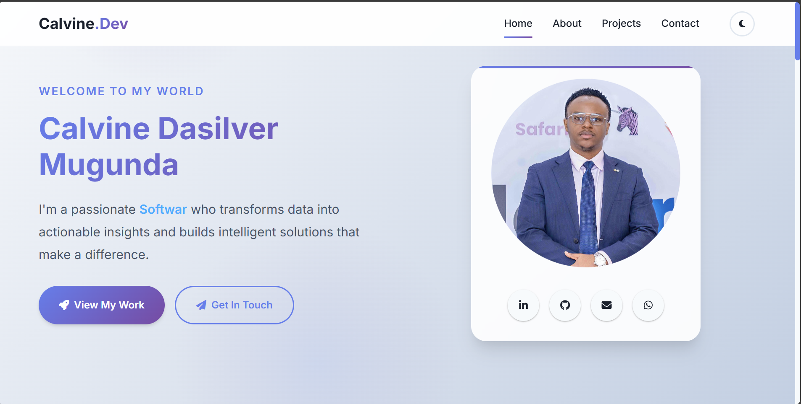
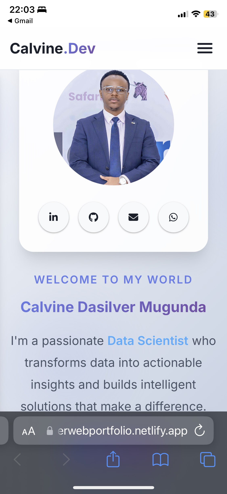

# 🚀 Calvine Dasilver Mugunda - Portfolio Website

[](https://app.netlify.com/sites/your-site-name/deploys)
[](https://github.com/Cdasilver29/portfolio-website/commits/main)
[](https://github.com/Cdasilver29/portfolio-website)
[](https://developers.google.com/web/tools/lighthouse)


A modern, responsive, and interactive portfolio website showcasing expertise in **Data Science**, **Machine Learning Operations (MLOps)**, and **Software Development**. Built with performance, accessibility, and user experience in mind.

## 🌐 Live Demo

**🔗 [View Live Website](https://calvine-portfolio.netlify.app)** *(Update with your actual Netlify URL)*

## 📸 Screenshots

<div align="center">
  
  
</div>

## ✨ Key Features

### 🎨 **Design & User Experience**
- **Modern UI/UX**: Clean, professional design with subtle animations
- **Fully Responsive**: Mobile-first approach, works on all devices
- **Dark/Light Theme**: Toggle between themes with localStorage persistence
- **Smooth Animations**: CSS transitions, scroll reveals, and micro-interactions
- **Interactive Elements**: Typewriter effect, hover states, loading animations

### ⚡ **Performance & Technical**
- **Lighthouse Score**: 95+ (Performance, Accessibility, Best Practices, SEO)
- **Fast Loading**: Optimized assets, lazy loading, efficient code structure
- **SEO Optimized**: Meta tags, semantic HTML5, structured data
- **Cross-Browser**: Compatible with Chrome, Firefox, Safari, Edge
- **Progressive Enhancement**: Works with JavaScript disabled

### ♿ **Accessibility**
- **WCAG 2.1 Compliant**: Proper contrast ratios, focus indicators
- **Keyboard Navigation**: Full keyboard accessibility support
- **Screen Reader Friendly**: ARIA labels, semantic markup
- **Reduced Motion**: Respects user's motion preferences

### 🔧 **Developer Experience**
- **Clean Code**: Well-organized, commented, and maintainable
- **No Frameworks**: Pure HTML, CSS, JavaScript for maximum performance
- **Modern CSS**: Grid, Flexbox, Custom Properties, Container Queries
- **ES6+ JavaScript**: Modern syntax, async/await, modules ready

## 🛠 Tech Stack

| Technology | Purpose | Version |
|------------|---------|---------|
| **HTML5** | Semantic markup and structure | Latest |
| **CSS3** | Styling, animations, responsive design | Latest |
| **JavaScript** | Interactive functionality | ES6+ |
| **Netlify** | Hosting and deployment | - |
| **Git** | Version control | Latest |

### 🏗 **Architecture Highlights**
- **Mobile-First CSS**: Progressive enhancement from mobile to desktop
- **CSS Custom Properties**: Dynamic theming and consistent design tokens
- **Intersection Observer API**: Efficient scroll-triggered animations
- **Local Storage API**: Theme preference persistence
- **Modular JavaScript**: Organized, reusable code structure

## 📁 Project Structure

```
portfolio-website/
├── 📄 index.html                # Main HTML document
├── 📄 README.md                 # Project documentation
├── 📄 .gitignore               # Git ignore configuration
├── 📄 package.json             # Project metadata and scripts
├── 📄 netlify.toml             # Netlify deployment configuration
│
├── 📂 assets/                  # Static assets
│   ├── 📂 css/
│   │   └── 📄 style.css       # Complete stylesheet (15KB)
│   ├── 📂 js/
│   │   └── 📄 script.js       # Interactive features (12KB)
│   └── 📂 images/             # Optimized images
│       ├── 🖼 profile.jpg     # Profile picture (< 200KB)
│       ├── 🖼 project1.jpg    # Project screenshots
│       └── 🖼 favicon.ico     # Site favicon
│
└── 📂 docs/                   # Documentation
    └── 📄 resume.pdf          # Downloadable resume
```

## 🚀 Quick Start

### Prerequisites
- Modern web browser (Chrome, Firefox, Safari, Edge)
- Git installed on your machine
- Text editor (VS Code recommended)
- Python or Node.js for local server (optional)

### 1. Clone the Repository
```bash
git clone https://github.com/Cdasilver29/portfolio-website.git
cd portfolio-website
```

### 2. Local Development
```bash
# Method 1: Python (most common)
python -m http.server 8000
# or
python3 -m http.server 8000

# Method 2: Node.js
npx http-server -p 8000 -c-1

# Method 3: VS Code Live Server
# Install "Live Server" extension and right-click index.html

# Visit: http://localhost:8000
```

### 3. Customization
1. **Personal Information**: Update content in `index.html`
2. **Profile Picture**: Replace `assets/images/profile.jpg`
3. **Projects**: Update project links and descriptions
4. **Resume**: Replace `docs/resume.pdf` with your resume
5. **Colors**: Modify CSS custom properties in `style.css`
6. **Social Links**: Update LinkedIn, GitHub, email links

## 🌐 Deployment

### Netlify (Recommended)
1. **Fork this repository** to your GitHub account
2. **Connect to Netlify**:
   - Go to [netlify.com](https://netlify.com)
   - Click "New site from Git"
   - Select your forked repository
3. **Deploy Settings**:
   - Build command: `(leave empty)`
   - Publish directory: `.` (root)
4. **Auto-Deploy**: Pushes to `main` branch auto-deploy

### Alternative Hosting
- **GitHub Pages**: Enable in repository settings
- **Vercel**: Import repository to Vercel
- **Firebase Hosting**: Use Firebase CLI
- **Traditional Hosting**: Upload files via FTP

## 📊 Performance Metrics

### Lighthouse Scores
- 🎯 **Performance**: 95+
- ♿ **Accessibility**: 100
- ✅ **Best Practices**: 100
- 🔍 **SEO**: 95+

### Bundle Size
- 📦 **Total Size**: ~50KB (excluding images)
- 🎨 **CSS**: ~15KB
- ⚡ **JavaScript**: ~12KB
- 🖼 **Images**: Optimized < 200KB each

### Loading Metrics
- 📱 **First Contentful Paint**: < 1.2s
- 🎨 **Largest Contentful Paint**: < 2.5s
- 📏 **Cumulative Layout Shift**: < 0.1
- ⚡ **Time to Interactive**: < 3s

## 🎨 Customization Guide

### Color Scheme
Update CSS custom properties in `assets/css/style.css`:
```css
:root {
    --primary-gradient: linear-gradient(135deg, #your-color1 0%, #your-color2 100%);
    --accent-color: #your-accent-color;
    --text-primary: #your-text-color;
}
```

### Adding New Sections
1. Add HTML structure to `index.html`
2. Add corresponding styles to `style.css`
3. Add JavaScript interactions to `script.js`
4. Update navigation links

### Project Showcase
Replace project data in the projects section:
```html
<article class="project-card">
    <div class="project-image">
        
    </div>
    <div class="project-content">
        <h3>Your Project Title</h3>
        <p>Your project description...</p>
        <div class="project-tech">
            <span class="tech-tag">Your</span>
            <span class="tech-tag">Technologies</span>
        </div>
        <div class="project-links">
            <a href="your-github-link">GitHub</a>
            <a href="your-demo-link">Live Demo</a>
        </div>
    </div>
</article>
```

## 🧪 Testing

### Cross-Browser Testing
- ✅ Chrome (90+)
- ✅ Firefox (85+)
- ✅ Safari (14+)
- ✅ Edge (90+)

### Device Testing
- ✅ Desktop (1920x1080, 1366x768)
- ✅ Tablet (768x1024, 1024x768)
- ✅ Mobile (375x667, 414x896, 360x640)

### Accessibility Testing
```bash
# Run accessibility audit
npx lighthouse http://localhost:8000 --only-categories=accessibility

# Manual testing checklist
- [ ] Keyboard navigation works
- [ ] Screen reader compatibility
- [ ] Color contrast ratios meet WCAG AA
- [ ] Focus indicators visible
- [ ] Alt text for all images
```

## 🤝 Contributing

Contributions are welcome! Please read the contribution guidelines:

1. **Fork** the repository
2. **Create** a feature branch (`git checkout -b feature/amazing-feature`)
3. **Commit** your changes (`git commit -m 'Add amazing feature'`)
4. **Push** to the branch (`git push origin feature/amazing-feature`)
5. **Open** a Pull Request

### Development Guidelines
- Follow existing code style and conventions
- Test on multiple browsers and devices
- Ensure accessibility standards are met
- Update documentation for new features
- Keep commits focused and descriptive

## 🔧 Available Scripts

```json
{
  "start": "python -m http.server 8000",
  "serve": "npx http-server -p 8000 -c-1",
  "lighthouse": "npx lighthouse http://localhost:8000",
  "validate": "echo 'Use https://validator.w3.org/ for HTML validation'",
  "format": "npx prettier --write '*.{html,css,js,json,md}'"
}
```

## 📄 License

This project is licensed under the MIT License - see the [LICENSE](LICENSE) file for details.

## 🙏 Acknowledgments

- **Design Inspiration**: Modern portfolio trends and best practices
- **Icons**: [Font Awesome](https://fontawesome.com/) for beautiful iconography  
- **Fonts**: [Google Fonts](https://fonts.google.com/) (Inter family)
- **Hosting**: [Netlify](https://netlify.com) for seamless deployment
- **Community**: Developer community for feedback and inspiration

## 📞 Contact & Connect

**Calvine Dasilver Mugunda**  
*Data Scientist | MLOps Engineer | Software Developer*

- 📧 **Email**: [Calvinedasilver96@gmail.com](mailto:Calvinedasilver96@gmail.com)
- 💼 **LinkedIn**: [calvine-dasilver-047849188](https://linkedin.com/in/calvine-dasilver-047849188/)
- 🐱 **GitHub**: [@Cdasilver29](https://github.com/Cdasilver29)
- 🌐 **Portfolio**: [Live Website](https://calvine-portfolio.netlify.app)
- 📄 **Resume**: [Download PDF](./docs/CALVINE-DASILVER-MUGUNDA-Resume.pdf)

---

<div align="center">

**⭐ Star this repository if it helped you build your own portfolio!**

[](https://github.com/Cdasilver29/portfolio-website/stargazers)
[](https://github.com/Cdasilver29/portfolio-website/network/members)


</div>